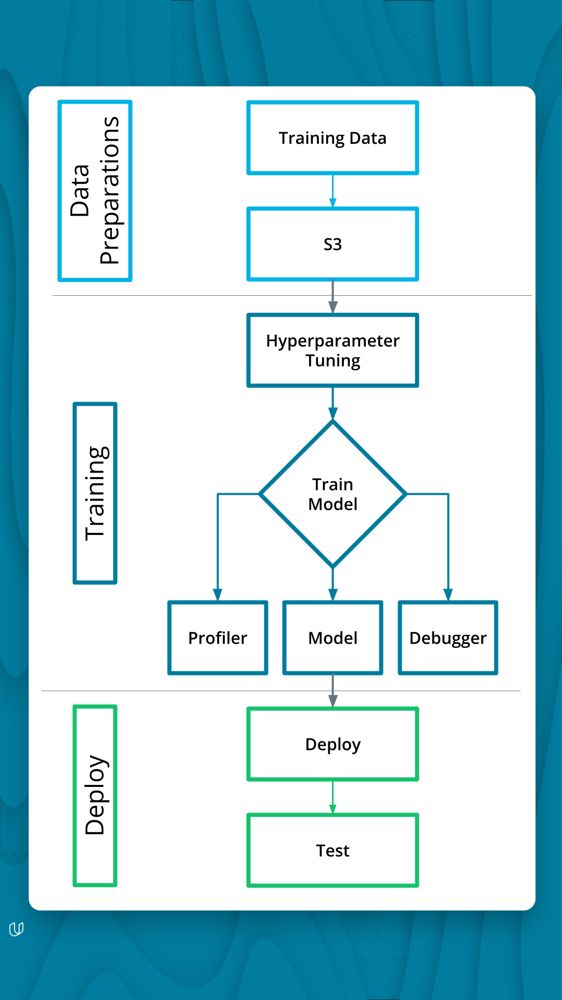
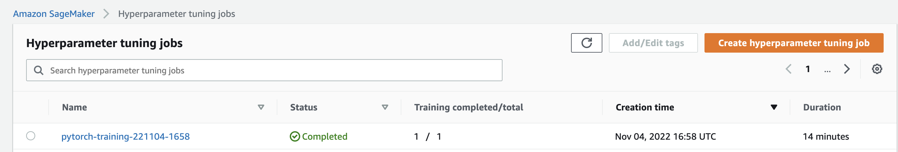
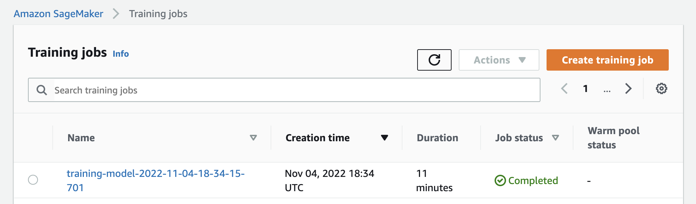
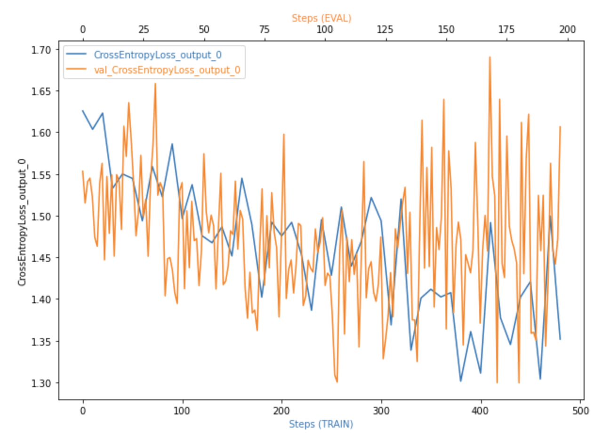
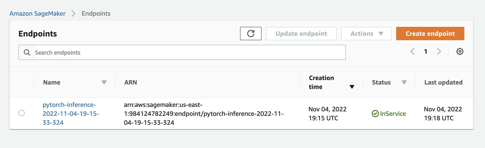

# Inventory Monitoring at Distribution Centers
 

There are a lot of labor requirements associated with manual inventory management, as well as the possibility of errors. So, there is a need for an effective inventory management.
Proper warehouse inventory management can save you money, including labor, storage, and fulfillment costs. This can be done by optimizing storage, investing in warehouse automation, organizing inventory to speed up the picking and packing process, and implementing technology to automate tasks that reduce human error.
Machine learning is one technology that can automate those processes. Computer vision can be used to automate inventory monitoring using convolution neural network to count the number of objects in each bin and ensure that delivery consignments contain the correct number of items.

## Dataset

The Amazon Bin Image Dataset contains over 500,000 images and metadata from bins of a pod in an operating Amazon Fulfillment Center. The bin images in this dataset are captured as robot units carry pods as part of normal Amazon Fulfillment Center operations.
Since this is a large dataset, a sample of the dataset is used. The dataset is available on Amazon S3.
There will be subfolders for the data subset created. The number of objects in each of these subfolders equals the name of the folder. In folder 1, for example, there is exactly one object in every image. Afterwards, training, testing, and validation datasets will be developed.

## Solution Statement
To solve this image classification problem, it will be used computer vision techniques, in this case a pre-trained (Resnet 50) deep learning model. As input, we provide an image of a bin containing products and as output, we give predicted scores for each category type, for instance, number of objects. All data will be storage at S3.
The algorithm will be built using Convolution Neural Netwook (CNN) and the framework Pytorch. To improve the performance of the model, SageMaker’s Hyperparameter Tuning will be used. After that, SageMaker endpoint will be created to deploy the model.
The SageMaker Studio will be used as our environment. To train the instance ml.g4dn.xlarge was used.

## Project Pipeline

## Hyperparameter Tuning
This project we will train a model (using ResNet50 and then hyperparameter tuning). 

Parameters range used for the hyperparameters search:

- learning rate - 0.0001 to 0.1
- batch size - 64, 128 and 256

## Hyperparameter tuning jobs

## Best training Hyperparameters
{'batch_size': 64, 'lr': '0.000748520739996759'}

## Training job with the best Hyperparameters

## Debugging and Profiling
The Debugging hook track the Cross Entropy Loss from training and validation phases as show below:

Is there some anomalous behaviour in your debugging output? If so, what is the error and how will you fix it?  
If not, suppose there was an error. What would that error look like and how would you have fixed it?

- Seems to have a little overfitting. We could try different neural network architecture or use some regularization like dropout.

## Model Deployment
We writed an inference script (endpoint.py) that implements model_fn, predict_fn and input_fn and deployed to a ml.m5.large instance. (learn more here: https://sagemaker.readthedocs.io/en/stable/frameworks/pytorch/using_pytorch.html#write-an-inference-script) and predicted in a test image.

